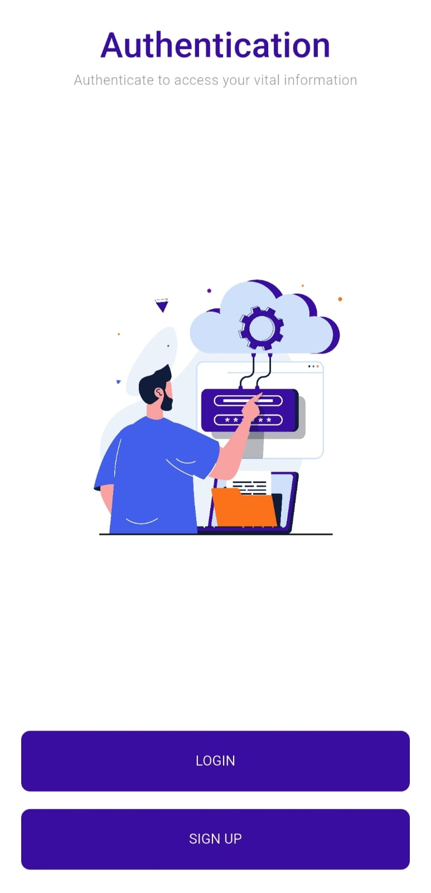
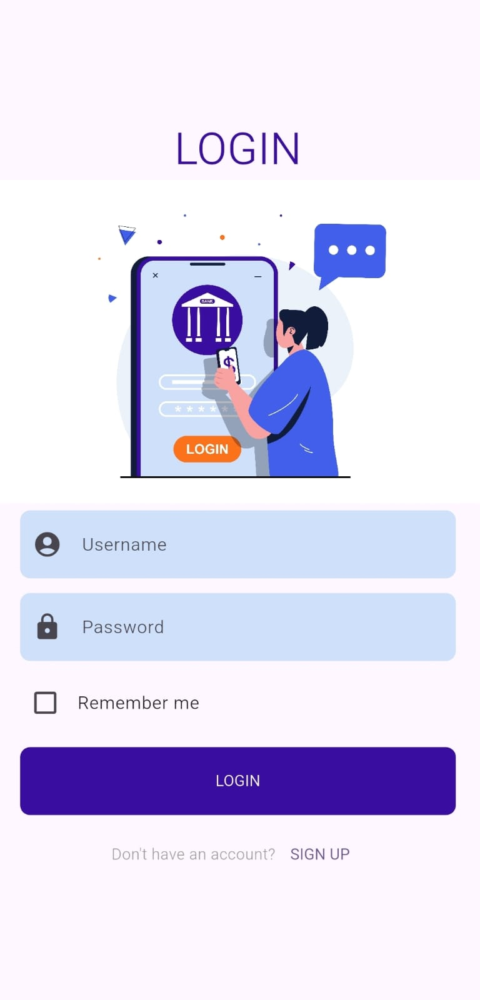
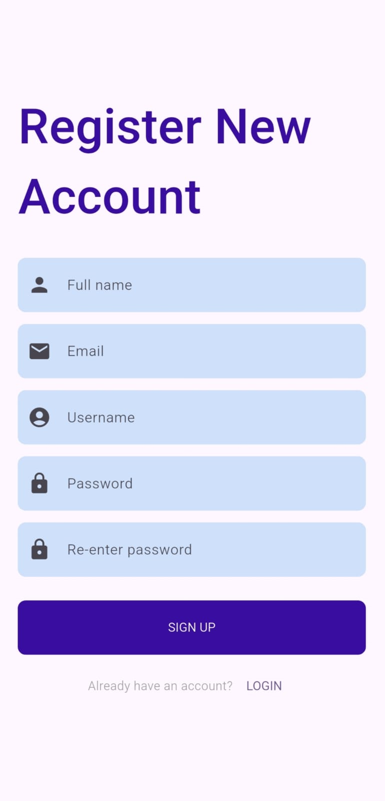
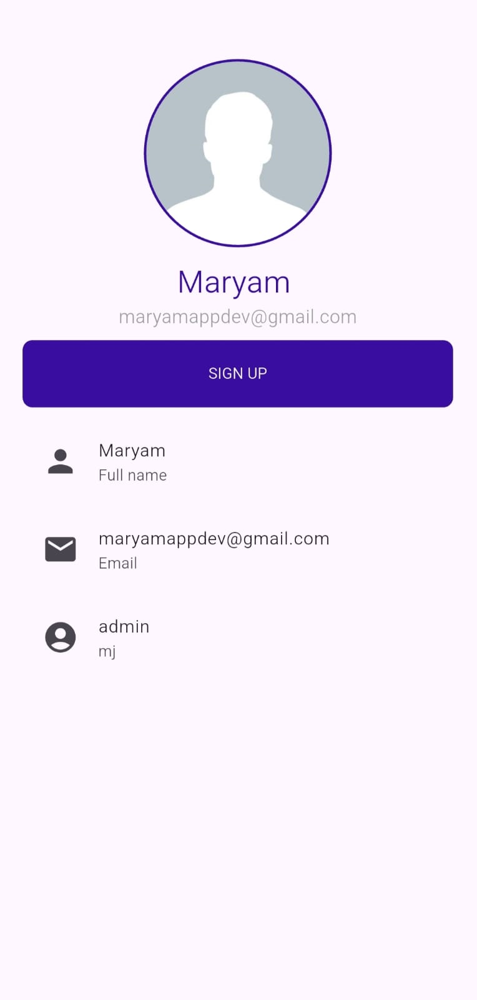

# 🔐 Flutter Local Authentication App

A complete local authentication system built using **Flutter** and **SQLite (sqflite)**.  
This project demonstrates user registration, login, and profile management using a local database.

---

## 🚀 Features

- ✅ User Signup (Full Name, Email, Username, Password)
- ✅ Username-based Login
- ✅ Profile Screen with user data
- ✅ SQLite Local Database Integration
- ✅ Unique Username Constraint
- ✅ Clean UI Structure
- ✅ Reusable Custom Widgets
- ✅ Safe Async Navigation Handling

---

## 📸 Screenshots

### Main Interface

| Auth Screen | Login Screen |
|------------|-------------|
|  |  |

| Signup Screen | Profile Screen |
|---------------|----------------|
|  |  |

---


### 🏗️ Project Structure
```
lib/
├── component/
│ ├── button.dart
│ ├── colors.dart
│ └── textfield.dart
│
├── json/
│ └── users.dart
│
├── sqflite/
│ └── database_helper.dart
│
├── views/
│ ├── auth_screen.dart
│ ├── login_screen.dart
│ ├── signup_screen.dart
│ └── profile_screen.dart
│
└── main.dart
```
---

### 🛠️ Technologies Used

- **Flutter** - UI Framework
- **Dart** - Programming Language
- **Sqflite** - SQLite Local Database


## 📝 Configuration

Edit `pubspec.yaml` to customize dependencies and app configuration.

## 👨‍💻 Author

**Maryam**
- GitHub: [@MaryamAPPDev](https://github.com/MaryamAPPDev)

---
